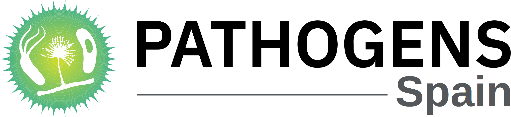

# 

# Spanish Pathogen Portal

This is the source code of the [Spanish Pathogens Portal](https://pathogensportal.isciii.es)

This website is the Spanish node for the  [central pathogens portal](https://www.pathogensportal.org/) project. It was created using a minimal/example hugo site for node pathogens portal, which uses a [theme](https://github.com/ScilifelabDataCentre/node-pathogens-portal-theme) inspired by [Swedish pathogen portal](https://www.pathogens.se/) and [Swiss pathogen portal](https://pathogensportal.ch/).

More information about Pathogen Portal Nodes (PPN) and Pathogen Data Network (PDN) can be found in this [Onboarding material](static/docs/Onboarding_Introduction.pdf)

This website is developed and maintained by the [Bioinformatics Unit at Institute of Health Carlos III](https://www.isciii.es/en/ub/unidad)

This website was built using the [Hugo](https://gohugo.io/) static site generator.

Instalation manual for Spanish Pathogen Portal can be found [in the installation manual](static/docs/installation.md)

Configuration manual for Node Pathogen Portal can be found [in the configuration manual](static/docs/manual.md)

## Credits

This project is supported by the National Institute Of Allergy And Infectious Diseases of the National Institutes of Health under Award Number U24AI183840. The content is solely the responsibility of the authors and does not necessarily represent the official views of the National Institutes of Health.

The website was develpped using the [Node Pathogen Portal template](https://github.com/ScilifelabDataCentre/node-pathogens-portal) developed by [Scilifelab Data Centre](https://www.scilifelab.se/data/) and [Swiss Institute of Bioinformatics](https://www.sib.swiss/) as part of [PDN project](https://pathogendatanetwork.org/) and is based on the [central pathogens portal](https://www.pathogensportal.org/), the [Swedish pathogen portal](https://www.pathogens.se/) and the [Swiss pathogen portal](https://pathogensportal.ch/).
